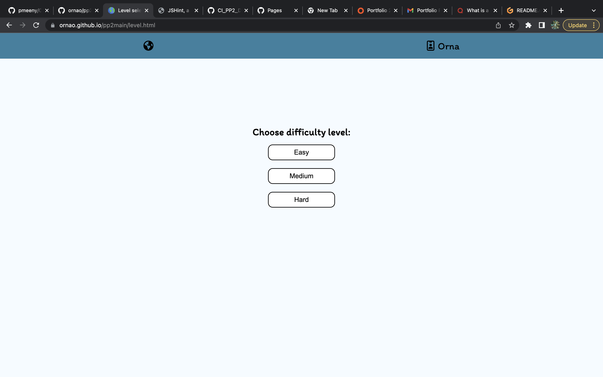
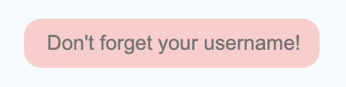
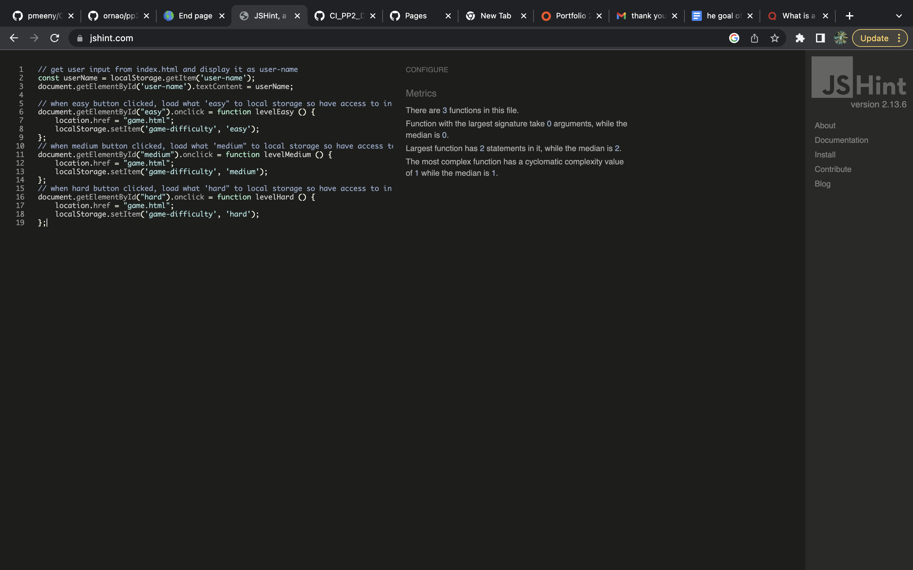
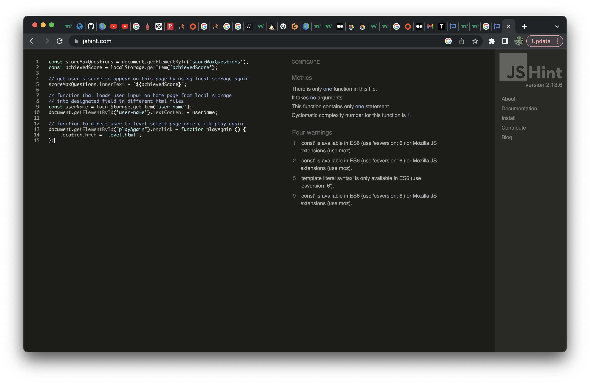
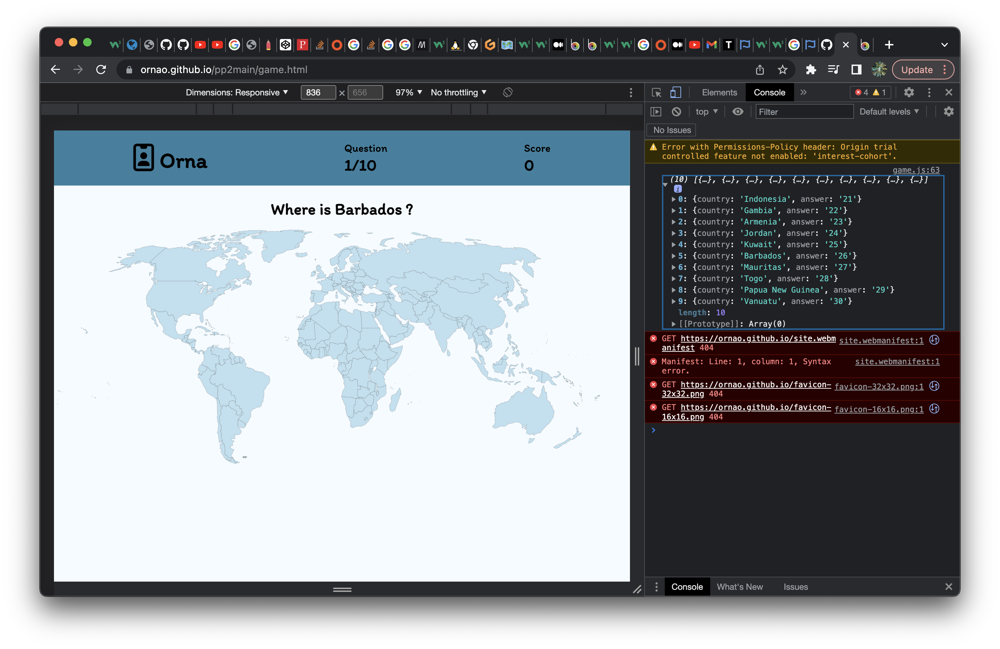
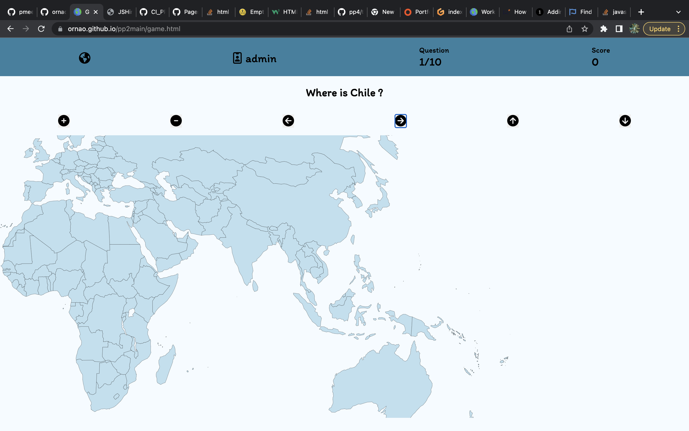

<h1>Where in The World?</h1>
<h2>Submission for portfolio project 2</h2>

** Developer: Orna Reynolds **

[Visit live website](https://ornao.github.io/pp2main/)

## Table of Content
  - [Project Goals](#project-goals)
    - [User Goals](#user-goals)
    - [Site Owner Goals](#site-owner-goals)
  - [User Experience](#user-experience)
    - [Target Audience](#target-audience)
    - [User Requirements and Expectations](#user-requirements-and-expectations)
  - [User Stories](#user-stories)
    - [Site User](#site-user)
    - [Site Owner](#site-owner)
  - [Design](#design)
    - [Colour Scheme](#colour-scheme)
    - [Fonts](#fonts)
    - [Structure](#structure)
    - [Wireframes](#wireframes)
  - [Technologies Used](#technologies-used)
    - [Languages](#languages)
    - [Frameworks, Libraries & Tools](#frameworks-libraries--tools)
  - [Features](#features)
  - [Validation](#validation)
    - [HTML Validation](#html-validation)
    - [CSS Validation](#css-validation)
    - [JavaScript Validation](#javascript-validation)
    - [Accessibility](#accessibility)
    - [Performance](#performance)
  - [Testing](#testing)
    - [Performing tests on various devices](#performing-tests-on-various-devices)
    - [Browser compatibility](#browser-compatibility)
    - [Testing user stories](#testing-user-stories)
  - [Bugs](#bugs)
  - [Deployment](#deployment)
  - [Credits](#credits)
  - [Acknowledgements](#acknowledgements)

## Project Goals

The goal of this project was to create an interactive and user-friendly quiz that tests knowledge of world geography.

### User Goals

- Take a quiz that is fun and informative 
- Challenge themselves at different difficulty levels 

### Site Owner Goals

- Create a quiz with accurate information on world geography
- Design a quiz to visually appeal and engage the user
- Ensure accessibility and responsivity across different screen sizes

## User Experience

### Target Audience

- Anyone with an interest in world geography 
- Anyone who wants to test their knowledge of world geography 

### User Requirements and Expectations

- Simple, clear and interactive layout 
- Responsiveness across different screen levels 
- Visible navigation to different difficulty levels, reset button

## User Stories
### Site User

1. I want to easily understand what the game is and how to play the game from the first page
2. I want to have my name displayed while playing
3. I want to be able to choose from different difficulty levels
4. I want incorrect answers to light up red and correct answers to light up green
5. I want 3 guesses only and then to move onto new screen
6. I want to get higher points when i click country correctly first time compared to second and third
7. I want to play game on phone and on laptop 
8. I want score and question number I am on to be displayed as I play the game
9. I want to be able to zoom into map so I am able to click correct country even if small
10. I want play again button at end of quiz and be able to change difficulty level for new game

### Site Owner

11. I want user to easily understand how to play game
12. I want quiz be responsive on different devices
13. I want a 404 page to show in case of broken link
14. I want user to be able to challenge themselves through different difficulty levels

## Design

### Colour Scheme

The colour palette was generated by <a href="http://colormind.io/image/">Colormind</a> when submitted a world map found on a google search. 

### Fonts
Itim from [Google Fonts](https://fonts.google.com/specimen/Itim?preview.text=Geography&preview.text_type=custom) was chosen as the font as it was clear, playful and had a hand-written feel which I felt suited the theme of the game. 

### Structure

The structure of the website was designed to be easy to navigate. 

The game consist of the following screens:

- A home page / start screen with game title, instructions how to play game and user login
- Choose game difficulty level screen with name displayed in top corner of screen
- Main game screen - it contains interactive map to click, questions clearly displayed, number of questions remaining in the round and current score which dynamically updates
- End page with most recent score from local storage
- A separate 404 error page

### Wireframes

index.html

level.html

game.html

end.html

feedback form

## Technologies Used

### Languages

- HTML
- CSS
- JavaScript

### Frameworks, Libraries & Tools

- Favicon.cc for getting the site favicon
- Font Awesome for main title of game
- Git was used for version control to push the code to GitHub
- GitHub was used as a remote repository to store project code
- Google Fonts
- Chrome dev tools were used for debugging of the code and check site for responsiveness
- WC3 Validator, Jigsaw W3 Validator, JShint, Wave Validator and Lighthouse were all used to validate the website
- Befunky to add text to screenshots

## Features

The website has 4 webpages consisting of a number of particular features

### Home page
The home page contains:
- The title of the game with spinning world icon (user-stories: 1)
- A short explanation of how to play (user-stories: 1)
- An input form for the user to enter their name (user-stories: 2)
- A start game button to bring user to next page (pick level of game page)

### Standout feature: 

#### Username input
- For start game button to bring user to next page, the user needs to enter a username of at least 4 characters long into the input field. If the input field is left blank and user clicks out of field, the background of the input field changes to red and the placeholder text changes to remind the user to complete the field. Furthermore, if only 3 letters are entered for example, then a alert message is displayed with message that at least 4 characters long username needs to be chosen. Once a valid username has been provided, the username is displayed next to the user icon on the next screen and user is able to select the difficulty level of the game.
- Username remains displayed on all game screens
- (user-stories: 2)
- I encountered a bug that with this aspect of my first submission for this project. JShint gave an error that neither function was called hence I called the function to make the js valid. However this led to the username input box becoming invisible to the user of my first submission contributing to the failing grade I received. I have now instead console.log the function name as a workaround to this bug and also to make the js valid concurrently. 

Screenshots

### Level page 
- Username displayed at top of page (user-stories: 2)
- buttons to choose difficulty level of game by fetching different json files that contain increasingly difficult questions (user-stories: 3, 14)

### Game page
- Interactive world map (svg) where the countries are individually defined into paths
- Heads up display that contains the username as input by user on home page (user-stories: 2), dynamic questions and score counter (user-stories: 6, 8)
- Question display that updates country every new question to a max of 10. The countries do not repeat. This allows user to see how long is left of round

### Standout feature: 

###  Interactive world map
- When question is asked map can be clicked to try and answer the question. If correct answer is picked, the country lights up green and if the incorrect country is picked the country lights up red (user-stories: 4). A new question appears either if correct country is chosen or user has reached max guesses(3) (user-stories: 5). Scores updates depending on how many guesses it took the user to get the right country (1st attempt = 3 points, 2 attempt = 2 points, 3rd attempt = 1 point) (user-stories: 6)

### End page 
- Displays most recent score along with username (user-stories: 2) to allow user to check how they are getting on with game
- Play again button that allow user to restart the game by bringing back to select difficulty screen (user-stories: 10)  

### Future features 
- Highscores page
- Modal to allow user to give me feedback
- Change alert message when incorrect username entered to something more user friendly like a pop-up

## Validation

### HTML Validation

The W3C Markup Validation Service was used to validate the HTML of the website. All pages pass with no errors.

Index

Level

Game

- 3rd party code was utilised in game.html which had a number of errors, did not correct in fear of breaking functionality

End

404

- 3rd party code was utilised in 404.html but did not have any major issues 

### CSS Validation

The W3C Jigsaw CSS Validation Service was used to validate the CSS of the website.
Style.css passes with no errors. 

Style.css

### JavaScript Validation

JSHint JS Validation Service was used to validate the Javascript files. 

In the original validation of index.js, the unused variable error message was raised and hence i called the function at end of file to fix this. However this ultimately caused the bug of my username input not displaying on the home page on original submission and led to my failing result. I had checked before submitting but as sometimes github can be slow updating changes to deployed website I did not realise this bug was present until after submission. I do understand how username input not appearing is obviously very frustrating for the user so I am glad I have found the bug and fixed it in the updated code.  

index.js

This was the orignal image included in project with configuration of JSHint not correctly set up:

This is the update version using corrected version of JSHint:

Example of error messge that ultimately caused the bug of my username input not displaying on the home page on orginal submission and led to my fail. The console.log is the simplest, easiest workaround I have found that allows the code to be valid through JSHint and not cause this bug. 

level.js

This was the orignal image included in project with configuration of JSHint not correctly set up:

This is the update version using corrected version of JSHint:

In the orignal validation of game.js, I had made a blunder with the configuration and hence instead of selecting "New JavaScript features (ES6)" in Assume of Configure in JShint and I had included 
{
  "esversion": 6
}
 at the top of file to allow me to use const as instructed by this [SlackOverflow post](https://stackoverflow.com/questions/27441803/why-does-jshint-throw-a-warning-if-i-am-using-const). However, I was proved very much mistaken by allowing this to be my technique for handling these errors. I mistakenly believed I had no errors in my original submission as a result. 

game.js

This was the orignal image included in project:

This is the update version using corrected version of JSHint:

end.js

This was the orignal image included in project:

This is the update version using corrected version of JSHint:
>

### Accessibility

The WAVE accessibility evaluation tool was used to ensure the website met high accessibility standards. All pages passed with no errors. 

Index

Level

Game

End

### Performance

Google Lighthouse in Google Chrome Developer Tools was used to test the performance of the website. Every page scored over 90 for mobile and desktop bar game.html for mobile testing - it received 88. 

Index

Desktop:

Mobile:

Level

Desktop:

Mobile:

Game

Desktop:

Mobile:

End

Desktop:

Mobile:

## Testing

### Performing tests on various devices

The website was tested using Google Chrome Developer Tools to check responsiveness at different screen sizes. 

The website was tested on the following devices:
- Macbook Pro 2017
- OnePlus Nord
- OnePlus Nord CE 2

### Browser compatibility

- Testing has been carried out on the following browsers:
  - Googe Chrome 
  - Safari

### Testing user stories

1. I want to easily understand what the game is and how to play the game from the first page

| **Feature**       | **Action**        | **Expected Result**                  | **Actual Result** |
| ----------------- | ----------------- | ------------------------------------ | ----------------- |
| Title of game and short explanation | Read the text | User immediately understands how to play | Works as expected |

Screenshot

2. I want to have my name displayed while playing

| **Feature**    | **Action**                                                           | **Expected Result**                               | **Actual Result** |
| -------------- | -------------------------------------------------------------------- | ------------------------------------------------- | ----------------- |
| Username input | Type user name that is at least over 4 characters and click start game button | User is brought to next page and name is displayed at top of page | Works as expected |

Screenshots

3. I want to be able to choose from different difficulty levels

| **Feature**       | **Action**        | **Expected Result**                  | **Actual Result** |
| ----------------- | ----------------- | ------------------------------------ | ----------------- |
| Different difficulty selection buttons | Click easy, medium or hard button | Different questions are loaded from different json files depending on choice | Works as expected |

Screenshot

Easy array loads and easy questions displayed when easy buuton clicked

Medium array loads and medium questions displayed when medium buuton clicked

Hard array loads and hard questions displayed when hard buuton clicked

4. I want incorrect answers to light up red and correct answers to light up green

| **Feature**       | **Action**        | **Expected Result**                  | **Actual Result** |
| ----------------- | ----------------- | ------------------------------------ | ----------------- |
| Interactive world map | Click a country on the map | Light up green or red depending on choice | Works as expected |

# Go in readme file itself or raw data to see rest of readme file is not showing here in preview or github preview for some reason
- this is a remanent of my original submission as I could not figure out why my readme file was not appearing in preview and git hub pages. It turns out I was missing a closing "details" tag for one of my dropdowns and as a result when viewing my original submission readme file one needed to open up all my dropdowns or look at raw data of readme file to view the content, testing and deployment section that I had done from this point on.

I raised this issue in github on submission hoping all my work would be visible to be examined.

Screenshots

5. I want 3 guesses only and then to move onto new question

| **Feature**       | **Action**        | **Expected Result**                  | **Actual Result** |
| ----------------- | ----------------- | ------------------------------------ | ----------------- |
| Interactive world map | Click wrong country 3 times | Move to new question | Works as expected |

Screenshots

6. I want to get higher points when i click country correctly first time compared to second and third

| **Feature**       | **Action**        | **Expected Result**                  | **Actual Result** |
| ----------------- | ----------------- | ------------------------------------ | ----------------- |
| Interactive world map | Click right answer on 1st attempt, then on 2nd for next question and then on 3rd for next question | Points should go up by 3, 2, 1 respectively | Works as expected |

Screenshots

7. I want to play game on phone and on laptop 

| **Feature**       | **Action**        | **Expected Result**                  | **Actual Result** |
| ----------------- | ----------------- | ------------------------------------ | ----------------- |
| Responsiveness on different devices | Play game on different screen widths and devices | All text should be visible and zoom of map should allow user to interactive with the large map when playing on smaller devices | All provided button for map controls work as expected |

Screenshots

8. I want score and question number I am on to be displayed as I play the game

| **Feature**       | **Action**        | **Expected Result**                  | **Actual Result** |
| ----------------- | ----------------- | ------------------------------------ | ----------------- |
| Heads up Display | Play game | score and questions update dynamically | Works as expected |

Screenshots

9. I want to be able to zoom into map so I am able to click correct country even if small

| **Feature**       | **Action**        | **Expected Result**                  | **Actual Result** |
| ----------------- | ----------------- | ------------------------------------ | ----------------- |
| Zoom button | Click map controls buttons provided to zoom and pan across map | Zoom and pan using controls of map should allow user to click the smallest of countries without trouble | All provided button for map controls work as expected |

Screenshots

10. I want play again button at end of quiz and be able to change difficulty level for new game

| **Feature**       | **Action**        | **Expected Result**                  | **Actual Result** |
| ----------------- | ----------------- | ------------------------------------ | ----------------- |
| Play again button | Press the button | User is brough back to difficulty selection page | Works as expected |

11. I want user to easily understand how to play game

| **Feature**       | **Action**        | **Expected Result**                  | **Actual Result** |
| ----------------- | ----------------- | ------------------------------------ | ----------------- |
| Title of game and short explanation | Read the text | User immediately understands how to play | Works as expected |

Screenshot

12. I want quiz be responsive on different devices 

| **Feature**       | **Action**        | **Expected Result**                  | **Actual Result** |
| ----------------- | ----------------- | ------------------------------------ | ----------------- |
| Responsiveness on different devices | Play game on different screen widths and devices | All text should be visible and zoom of map should allow user to interactive with the large map when playing on smaller devices | All provided button for map controls work as expected |

Screenshots

13. I want a 404 page to show in case of broken link

| **Feature**       | **Action**        | **Expected Result**                  | **Actual Result** |
| ----------------- | ----------------- | ------------------------------------ | ----------------- |
| 404 page | Loading error | User brough to custom 404 page and given option to return to home page | Works as expected |

Screenshot

14. I want user to be able to challenge themselves through different difficulty levels

| **Feature**       | **Action**        | **Expected Result**                  | **Actual Result** |
| ----------------- | ----------------- | ------------------------------------ | ----------------- |
| Different difficulty selection buttons | Click easy, medium or hard button | Increasing difficult questions are loaded from different json files depending on choice | Works as expected |

Screenshot

Easy array loads and easy questions displayed when easy buuton clicked

Medium array loads and medium questions displayed when medium buuton clicked

Hard array loads and hard questions displayed when hard buuton clicked

## Bugs

| Bug                                                                                                                                         | Fix                                                                                    |
| ------------------------------------------------------------------------------------------------------------------------------------------- | -------------------------------------------------------------------------------------- |
| Colors were not showing up until the 2nd click(2nd right or wrong answer)            | function was being told needed to be clicked twice to work, removed 2nd onclick to get colors appearing when answers first clicked  |
| 3 undefined country clicks caused random countries to light up  | added parameter to else statement when comparing correct answer through data numbers and giving half the undefined countries a data number of x         |
end.html page would not load when deployed to github pages | changed pathway to include name of project and that worked |
colors being persistent and then not showing when clciked | set timeout function so can see country for a sec before disappearing and removing class once new question starts |
| username input invisible to user | removed call to function and username displayed input for username once again|
|controls for map move whole svg and hence when zoomed in it appears right, left and up, down and working backwards |swap left for right and up for down to make buttons more user friendly|

 ### Future Bug fixes |
| Bug                                                                                                                                         | Possible Fix                                                                                    |
| ------------------------------------------------------------------------------------------------------------------------------------------- | -------------------------------------------------------------------------------------- |
noticed random country appearing when clicking guesses again when going fast through quiz | could be due to not have defined at the countries and hence same issue as before |
| 4 blank spaces can be entered as username, need to improve validation of username for this |
|username box goes red when criteria met, name is still accepted. only appears when valid name typed immediately and start game pressed | username input box has caused me enough issues and while this red display is a bug it does not affect the main functionality of the username validation and display so i will look at this in future by looking at functions |
| after 3 wrong answers, new questions appears very quickly nearly before color appears to tell user last selected country was wrong for last question | i would like to increase the time between |
|if select any where in sea (blank bit of map) that counts as a guess| i would like to possible try to eliminate this so user doesnt waste guess by accident |

## Deployment

### GitHub Pages
The website was deployed using GitHub Pages:
1. In git hub, go to settings tab
2. On the left hand menu, select Pages
3. For the source select Branch: main
4. Once saved, GitHub will refresh and your website will be publishd from GitHub repository
5. The link to your published website will appear after a minute or two

## Credits

### Images

Interactive World Map

[Simple Maps](https://simplemaps.com/resources/svg-world)

[Image of earth at top of readme file from freepik](https://www.freepik.com/free-psd/3d-icon-render-vegan-lifestyle_31260449.htm#query=world%20emoji&position=7&from_view=search&track=ais)

### Code

Interactive World Map 

[Make a Clickable SVG Map using HTML & CSS](https://youtu.be/l-9YQUmTOdI) 

[Help with understand how to create a game quiz using HTML, CSS, JS - JAMES Q QUICK youtube channel](https://www.youtube.com/watch?v=DFhmNLKwwGw&list=PLDlWc9AfQBfZIkdVaOQXi1tizJeNJipEx&index=10) 

[How to save to local storage](https://www.youtube.com/watch?v=x0VcigW9kN0) 

[Understanding e target](https://softauthor.com/e-target-in-javascript/)

[Zoom and pan functionality](https://onestepcode.com/zoom-pan-effect-svg/)

Specific code used mentioned throughout comments

## Acknowledgements

My wonderful and patient boyfriend for helping me with testing and student care for being very accomodating and flexible regarding my resubmission date
 

